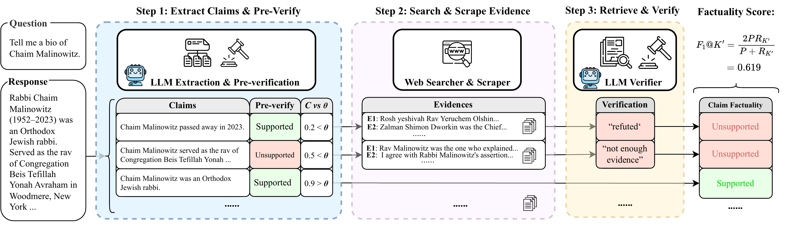
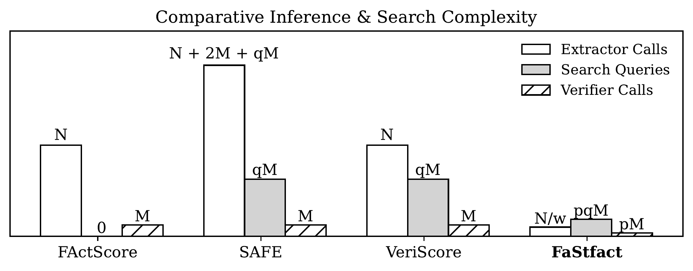

# ⚡ FaStfact

FaStfact is a reliable and efficient factuality evaluation framework of long-form generations, attested among existing baselines to achieve (1) the least time complexity and token cost and (2) the closest alignment with human judgment.

<p align="center">
  
</p>

The repo for the EMNLP 2025 finding paper: [FaStfact: Faster, Stronger Long-Form Factuality Evaluations in LLMs](https://arxiv.org/pdf/2510.12839). We open-source:
- [**FaStfact**](#--run-fastfact): an easy-to-run tool for evaluating long-form factuality of any QA generation in any length;
- [**FaStfact-Bench**](#-fastfact-bench): a fully annotated long-form factuality benchmark of 400 pairs of LLM QA generations;
- [**Factuality Annotation Tool**](#-factuality-annotation-tool): Interface tool for FaStfact-Bench annotation.

## 📁 Repository Structure
```
FaStfact/
├── assets/
├── configs/
│   ├── default.json
│   └── README.md
├── data/
│   ├── data_sample.jsonl
│   └── data_sample2.jsonl
├── FaStfact-Bench/
│   ├── FastFact_annotation/
│   ├── fastfact-bench_annotated.jsonl
│   └── fastfact-bench_for_eval.jsonl
├── pipeline/
│   ├── __init__.py
│   ├── claim_extractor.py
│   ├── claim_verifier.py
│   ├── config.py
│   ├── FaStfact.py
│   ├── response_API.py
│   ├── retriever.py
│   ├── score_metrics.py
│   ├── utils.py
│   └── web_search_API.py
├── prompt/
│   ├── extraction/
│   └── verification/
├── requirements.txt
```

## ⚙️ Setup
1. Innitialize a new Python 3.9+ environment using `virtualenv` or `conda`.
2. Install the requirements.
3. Download `en_core_web_sm` using `spacy` library
```
conda create --name [YOUR CONDA ENV NAME] python=3.9
pip install -r requirements.txt
python -m spacy download en_core_web_sm
```

4. In [pipeline/.env](pipeline/.env), add an OpenAI or Claude API key for claim extraction and verifictaion; then add a Jina Reader API key for web search and scraping (Get the free API key [here](https://jina.ai/reader)). Alternatively, you can modify [/FaStfact/web_search_API.py](/FaStfact/web_search_API.py) with your own searching API and scraping tools.
```
OPENAI_API_KEY=[YOU OPENAI KEY]
JINA_KEY=[YOUR JINA READER KEY]
```

## 🚀  Run FaStfact

FaStfact evaluation follows the standard decompose-then-verify framework, which consists of three steps: (1) `claim extraction`, (2) `evidence collection`, and (3) `claim verification`. 

This is an end-to-end pipeline for running FaStfact on a input file containing long-form QA generations.

### 💡 Example 1: run with a config file
Example configurations are available in the `configs/` directory. You can customize config parameters in [configs/default.json](configs/default.json).

```
python3 -m pipeline.FaStfact \
  --data_dir ./data \
  --input_file data_sample.jsonl \
  --config configs/default.json
```

### 💡 Example 2: run with overriding CLI arguments

```
python3 -m pipeline.FaStfact \
  --data_dir ./data \
  --input_file data_sample.jsonl \
  --model_name_extraction gpt-4o-mini \
  --model_name_verification gpt-4o-mini \
  --pre_veri_label_m 6 \
  --label_n 5 \
  --stride 0 \
  --token_prob_threshold 0.995 \
  --response_worker_num 32 \
  --search_worker_num 3 \
  --ignore_cache
```

### 🔧 Configuration

#### Input:
Two sample input files are provided in [./data](./data) (data_sample.jsonl and data_sample2.jsonl). It should be in the `jsonl` format where each json line contains:
* `question`: A query to prompt a language model for an output; value = "" if you are evaluating non-qa generation.
* `response`: An output generated by the language model
* `model`: Name of the model that generated the response
* `prompt_source`: Name of the dataset from where the `question` is from (e.g., FreshQA)

#### Arguments:

* `data_dir`: Directory containing input data. `./data` by default.
* `input_file`: Name of the input data file.
* `model_name_extraction`: Name of the model used for claim extraction; `gpt-4-0125-preview` by default.
* `model_name_verification`: Name of the model used for claim verification; `gpt-4o` by default.
* `ignore_cache`: If specified, ignores cached results and recomputes everything. False by default.

<details>
<summary> Other optional arguments: </summary>

* `stride`: You can specify a fixed stride in chunking; `0` means feeding the whole response for extraction; `-1` means dynamic stride based on response length.
* `search_res_num`: The number of evidence results to search for and save. `5` by default.
* `verify_res_num`: The number of evidence results used for verification. `5` by default.
* `label_n`: This is the type of label for claim verification. It could be `2` (binary) or `3` (ternary):
    * `2`: `supported` and `unsupported`.
    * `3`: `supported`, `contradicted`, and `inconclusive`.
* `pre_veri_label_m`: The number of labels used in the pre-verification step.
* `do_not_pre_verify`: If specified, skips the pre-verification step. False by default.
* `logprob_threshold`: The log probability threshold for filtering extractions. Defaults to negative infinity (`-inf`).
* `use_external_extraction_model`: If specified, it uses your custom model instead of the one from the API call. We use Unsloth for the fine-tuned model. False by default.
* `use_external_verification_model`: If specified, it uses your custom model instead of the one from the API call. We use Unsloth for the fine-tuned model. False by default.
* `use_base_extraction_model`: If specified, it uses an open-source model for extraction. False by default.
* `use_base_verification_model`: If specified, it uses an open-source model for verification. False by default.

</details>

#### Saved Output:

The example output will be saved in an output folder called "data_sample/m=5_gpt-4o-mini_gpt-4o-mini/". Its name is constructed as follows:```{input_filename}/m={pre_veri_label_m}_{model_name_extraction}_{model_name_verification}```

Within this folder, you'll find the following files:

*   **`claims.jsonl`:** Contains the extracted claims from the input responses by the extractor.
*   **`retrieved_evidence.jsonl`:** Contains each extracted claim and their corresponding web-search results (evidence), including (1) the raw web-page documents and (2) the retrieved evidence related to each claim.
*   **`verification_n=?.jsonl`:** Contains each extracted claim, their corresponding evidence, and their verification label by the verifier.
*   **`fsfact_score_n=?.csv`:** Contains the calculated average Precision, Recall, F1@K, etc. across all verified claims.

## 📊 FaStfact-Bench

FaStfact-Bench is a comprehensive long-form factuality benchmark consisting of **400 fully annotated QA generation pairs** from diverse domains, tasks, and elicited generation lengths. We aggregated the prompt from five benchmarks below, collected long-form generatins from four SOTA LLMs (DeepSeek-R1, DeepSeek-V3, GPT-4o and Qwen-2.5-Instruct), and manually annotate their factuality including extracted claims and verification labels.

| **Prompt Source** | **Domain** | **Task Type** | **Prompt (Words)** | **Prompt (Sents)** | **Resp (Words)** | **Resp (Sents)** | **Samples** |
|---|---|---|---:|---:|---:|---:|---:|
| FActScore-Bio | Biography | "Tell me the bio of ..." | 7.1 | 1.05 | 222.8 | 11.2 | 80 |
| Factcheck-Bench | General | Fact-seeking general QA | 13.0 | 1.20 | 281.5 | 17.9 | 80 |
| ExpertQA | Domain Expertise | Domain-specific situational QA | 101.6 | 7.55 | 512.6 | 37.0 | 80 |
| LongFact | General | Concept explanation; object description | 47.0 | 2.45 | 586.6 | 36.0 | 80 |
| HelloBench | General | Open-ended QA; advice; essay writing | 115.1 | 11.00 | 721.8 | 51.6 | 80 |
| **FaStfact-Bench** | **(Aggregated)** | **(Aggregated)** | **56.8** | **4.65** | **465.1** | **30.8** | **400** |

### 📈 Model Leaderboard

We evaluate various state-of-the-art LLMs on FaStfact-Bench using our F1@K' metric:

<p align="center">
  
</p>

*Table: Performance of different LLMs on FaStfact-Bench benchmark*

### 📏 FaStfact Score F1@K'

FaStfact scores F1@K' focus on two dimensions of factuality: **factual precision** P and **factual recall** R (which represents factual density). 

Unlike existing metrics that use a fixed K averaged from sampled generations, FaStfact uses ground-truth **K'** (the actual number of claims that should be extracted from each specific generation) from FaStfact-Bench and imposes **symmetric penalties** for both insufficient and excessive claim coverage:

$$R_{K'}(y) = \frac{2}{1 + e^{\gamma |S(y) - K'|}}$$

$$F_1@K' = \frac{2P(y)R_{K'}(y)}{P(y)+R_{K'}(y)}$$

where $S(y)$ is the number of supported claims and $\gamma$ is a scaling hyperparameter. See paper for more details.


## "Faster, Stronger": FaStfact as an Evaluation Tool

### Faster: Comparison with Evaluation Baselines
FaStfact achieves **the least time complexity and token cost** among existing factuality evaluation baselines while maintaining **the closest alignment with human judgment**.

<p align="center">
  
</p>

*Table: Comparison of time complexity and token cost across different factuality evaluation methods*

### Stronger: Comparison with Evaluation Baselines

We compare FaStfact against existing factuality evaluation baselines in terms of **ground-truth alignment** and **token cost**:

| **Evaluation Pipelines** | **FaStfact** | **ExpertQA** | **FacTool** | **VeriScore** | **SAFE** |
|---|---:|---:|---:|---:|---:|
| F1@K' (Ground-truth F1@K' = 0.792) | 0.780 | 0.919 | 0.987 | 0.899 | 0.960 |
| \|ΔF1@K'\| (Score Alignment) ↓ | **0.012** | 0.127 | 0.195 | 0.107 | 0.168 |
| \|ΔK\| (Number of Claims Alignment) ↓ | **3.35** | 21.26 | 9.09 | 7.32 | 14.28 |
| Avg Token Cost ↓ | **5,615** | 7,893 | 4,480 | 22,848 | 49,622 |


*Note: ExpertQA is imported from FActScore with Google Search augmentation. FacTool is implemented in the knowledge-based QA setting to be compatible with FaStfact-Bench domains. ↓ indicates lower is better.*


## 📝 Factuality Annotation Tool

We open source the annotation interface tool for collecting human groundtruths as well as annotation guidelines.
See [./FaStfact-Bench/FastFact_annotation](./FaStfact-Bench/FastFact_annotation).